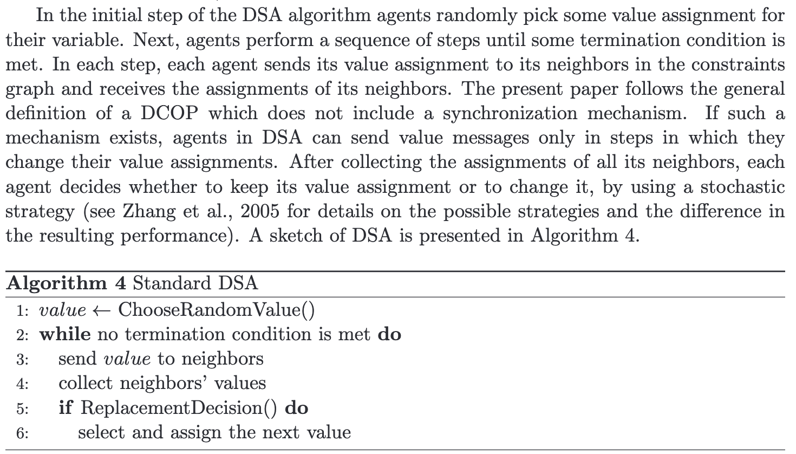

# :postbox: **Distributed constraint optimization Problem** :postbox: 

This repo serves as an implementation of two DCOP algorithms in Python using random, numpy, matplotlib, and tqdm.

## Overview 

A DCOP is a problem in which a group of agents must distributedly choose values for a set of variables such that the cost of a set of constraints over the variables is minimized. 

### DSA :game_die: (Distributed Stochastic Algorithm)

### MGM :envelope: (Max Gain Message)

## Code Overview
Contains a few main functions:

**graph_operator(p1)** - this method will be called upon twice. one with branching factor of 0.2 and second with branching factor of 0.5 (a more complex graph)
method is responsible of:
1. Creating the network - creating a graph. p1 is the branching factor (the probability of two agents to be "connected").
2. runs the solver of DSA twice :
	1. The probability of each agent changing the assignment is 0.7
	2. The probability of each agent changing the assignment is 0.4
3. Runs the solver of mgm

**graph_generator()** - responsible of creating a double graphed image, one graph for each network(p1=0.2,p1=0.5),that compares performances of all algorithms

Assignment instructions can be found in Assignment 2.doc

# Credit

[Asymmetric Distributed Constraint Optimization Problems](https://jair.org/index.php/jair/article/view/10828)
